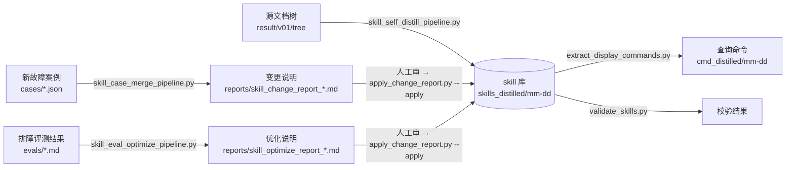

# skill_distill

把 IPRAN 网络运维排障文档蒸馏成网管 agent 可直接使用的 skill 文件，并在此后随新故障案例、随排障评测结果持续维护这套 skill 库。

生成的 skill 面向**执行排障的 agent**，不是给人看的手册：凡是"收集信息联系技术支持""提交给工程师""抓包分析"这类 agent 做不到的动作，一律不写进正文。

## 三条主线



| 主线 | 输入 | 做什么 | 落盘方式 |
| --- | --- | --- | --- |
| 批量蒸馏 | 源文档树 | 按目录分组，每组多篇文档合并成一个 skill | 直接写 |
| 增量并入 | 新故障案例 JSON | 判断已覆盖 / 追加小节 / 新建 skill | 出报告 → 人工审 → 落盘 |
| 评测优化 | 排障评测结果 | 定位是哪一步判据误导了 agent，整篇重写 | 出报告 → 人工审 → 落盘 |

后两条都是"先出报告、审过再落盘"，原因见[为什么落盘要单独一个脚本](#为什么落盘要单独一个脚本)。

## 快速开始

### 1. 配置模型接入

地址和密钥放在**不入库**的 `.env`：

```bash
cp .env.example .env
# 编辑 .env 填入实际地址与密钥
```

```ini
QWEN36_BASE_URL=http://<host>:<port>/v1
QWEN36_API_KEY=

QWEN38_BASE_URL=http://<host>:<port>/v1
QWEN38_API_KEY=

MINIMAX_BASE_URL=http://<host>:<port>/v1
MINIMAX_API_KEY=<your-api-key>
```

环境变量优先于 `.env`，可临时覆盖：`QWEN36_BASE_URL=... python3 xxx.py`。

### 2. 自查配置是否解析正确

```bash
python3 model_config.py
```

```
● MiniMax-M2.7
    地址      : http://127.0.0.1:4002/v1/chat/completions
    密钥      : sk-cac-…4pS7（54字符）
    max_tokens: 32768
    思考      : 会思考（不发关思考的字段，预算已留给推理）
```

密钥会打码。**思考开关按模型区分**：给 qwen 关思考的 `enable_thinking: False` 若发给会思考的模型，要么把思考压掉、要么根本不起作用，所以这类模型完全不发这个字段。注意"会思考"是按实测登记的——`MiniMax-M2.7` 虽然名字里没有 thinking，实测同样返回 `reasoning_content`，推理照样吃输出预算。

### 3. 探测链路是否真的通（建议先跑）

```bash
python3 model_config.py --probe
```

用 `max_tokens=1024` 的小请求验证鉴权、响应体是否为 JSON/SSE、回复结构能否取到 `content`：

```
    探测      : [OK] HTTP 200，content='OK'
    探测      : [OK] HTTP 200，SSE流（该端点无视stream=False，已按流式解析），content='OK'，另有 reasoning_content 43字符
    探测      : [WARN] HTTP 200，链路通，但正文为空、只回了推理——探测预算被思考吃光了
    探测      : [FAIL] HTTP 200 但响应体不是JSON（Content-Type=text/html，响应体为空）
```

优化流水线一次调用要几分钟，先探测能避免等十几分钟才发现是链路问题。

**关于 SSE**：有的端点无视 `stream: False`、一律返回 `text/event-stream`。这是可正常工作的形态——`call_model_with_retry` 会把流拼回完整回复，`content` 与 `reasoning_content` 分别累加，并显式按 UTF-8 解码（SSE 的 Content-Type 通常不带 charset，否则中文会成乱码）。

---

## 场景 1：首次批量蒸馏

把整棵源文档树转成一套 skill 库。

```bash
# 1. 确认源文档树路径与输出目录（改 skill_self_distill_pipeline.py 末尾的 main 参数）
#    SOURCE_TREE_DIR="result/v01/tree"
#    OUTPUT_DIR=f"skills_distilled/{今天mm-dd}"
python3 skill_self_distill_pipeline.py

# 2. 校验产出
python3 validate_skills.py skills_distilled/07-27
```

**分组规则**：`<源目录>/一级目录/二级目录/*.md` 归为一组，输出成 `<一级中文>/<二级中文>.md`。散落在一级目录下没套二级目录的文档，会并入名称最相似的既有二级分组；匹配不上或该一级目录压根没有二级目录时，全部合并为 `<一级名去前缀>故障案例.md`（如 `故障处理：QoS` → `QoS故障案例.md`）。每篇散文档的归并决策都会打印出来，**需要核对归属**。

**产出**：skill 文件、`skill_tree_structure.txt`（树结构索引）、`conversion_report.json`（转换记录）。

**只重跑部分分组**：校验出 ERROR 时 `validate_skills.py` 会直接打印可复制的参数：

```bash
GROUPS=["故障处理：IP组播/IP组播故障案例", "故障处理：IP路由/BGP故障案例"]
```

把它填进 `main(..., GROUPS=[...])` 再跑，只会重跑这几组，`conversion_report.json` 按 `skill_path` 增量合并，没跑的分组保留上次记录。

---

## 场景 2：增量并入新故障案例

有新的故障案例（PPT/表格提取成 JSON）要并进既有 skill 库。

```bash
# 1. 案例 JSON 放到 cases/，确认 skill_case_merge_pipeline.py 末尾的参数：
#    CASES_PATH / SKILL_DIR / DRY_RUN=True
python3 skill_case_merge_pipeline.py

# 2. 人工审 reports/skill_change_report_<mm-dd>.md

# 3. 预演落盘（不写文件）
python3 apply_change_report.py reports/skill_change_report_07-30.md skills_distilled/07-27

# 4. 确认无误后实际写入
python3 apply_change_report.py reports/skill_change_report_07-30.md skills_distilled/07-27 --apply

# 5. 有「新建skill」时刷新树结构
python3 build_skill_tree.py skills_distilled/07-27

# 6. 校验
python3 validate_skills.py skills_distilled/07-27
```

**流程内部**：载入案例（跳过只有标题的补充页、标注"已废弃/已从场景基线中去除"的条目）→ 按`故障类型`归组 → **定位**每组该并入哪个既有 skill 或新建 → **合并**判定 `covered` / `append` / `create` → 出报告。

**每篇 skill 必须有的两节输出要求**（写在 `WRITING_RULES` 里，三条流水线共用）：

- **诊断结论输出要求**：定位到根因时输出「故障对象」（具体到网元名、端口/接口/会话名）、「根因类型」、「原因」（一句自然语言且必须含故障对象）、「修复建议」；未定位到根因时必须明确输出"未找到根因"并列出已执行的检查项，不许用推测代替根因。
- **修复方案输出要求**：按方案逐条输出「方案序号」「方案说明」「修复对象名」「CLI序列」；走管控接口的给出路径与入参并注明不下发 CLI。参数取值来自数据查询、资源分配、配置下发三类接口。多个可选方案全部列出交人选择。

**判 `covered` 的三条硬性前置**（少一条就必须判 `append`）：新案例的触发告警、管控接口/API、检查范围，在既有 skill 里都得有。写得越全的 skill 越容易被误判成"已覆盖"，所以这里刻意收紧。

**定位结果不稳定时钉死它**：判"新建"时是让模型自己编路径，同一批案例重跑可能编出不同目录和文件名。路径一旦定下来就写进 `TARGET_OVERRIDES`：

```python
TARGET_OVERRIDES = {
    "链路性能越限": "故障处理：QoS/切片链路带宽越限故障案例.md",
}
```

---

## 场景 3：按评测结果优化 skill

排障评测判了"诊断失败"，需要找出 skill 里是哪一步判据误导了 agent 并改掉。

```bash
# 1. 评测结果放到 evals/（自然语言即可），先确认每条落在哪篇 skill 上（不调模型）
python3 skill_eval_optimize_pipeline.py --check

# 2. 跑优化，出报告
python3 skill_eval_optimize_pipeline.py

# 3. 人工审 reports/skill_optimize_report_<mm-dd>.md
#    重点看「匹配方式」是否精确匹配、fixes 有没有点到真问题、改动内容有没有丢场景

# 4. 逐行看落盘前后的差异（整篇覆盖必看）
python3 apply_change_report.py reports/skill_optimize_report_07-30.md skills_distilled/07-27 --diff

# 5. 确认无误后写入
python3 apply_change_report.py reports/skill_optimize_report_07-30.md skills_distilled/07-27 --apply

# 6. 校验
python3 validate_skills.py skills_distilled/07-27
```

### 评测结果怎么写

自然语言，只需要一行标记说明对应哪篇 skill：

```markdown
对应SKILL: IP路由/BGP故障案例.md

人工判断：诊断失败

排障将AS号不匹配的故障误判为对端TCP连接失败，未识别出注入的AS号错误。

| 检查项 | 结果 | 状态 |
| --- | --- | --- |
| AS号配置 | eBGP邻居AS号不同，配置正确 | ✅ 正常 |
| TCP状态 | LISTEN + Foreign Port = 0，本端已发送SYN但未收到响应 | ❌ 异常 |
```

一个文件里可以放多条记录（每条以 `对应SKILL：` 开头）；同一篇 skill 的多条评测会合成一次模型调用，让模型一次看到这篇的全部问题。marker 之前紧邻的标题行（如 `## BGP邻居状态异常` / `### as-number不匹配`）会归到这条记录的开头当上下文。

**建议附上「正确的诊断流程」**——如果你手上有这类故障的权威诊断流程（故障类型、触发告警、逐步判据、方案生成、配置样例、对管控的依赖），加一节写进去，模型会以它为准来校准 skill：冲突的判据改掉、缺的步骤补上、顺序按它组织，并逐条检查"转步骤X"指向的小节是不是真的是那一步该做的事。

只给失败记录，模型只能在出错的那一步附近打补丁；给了权威流程，它才知道该改成什么样。实测中一处关键缺陷（场景F 步骤2 写着"转步骤3检查AS号和Router ID"，而步骤3 其实是"修复Peer IP不匹配"，排查链在这里断掉）三个模型都没发现，正是因为没有流程可对照。

```markdown
# 正确的诊断流程
故障类型：BGP邻居状态异常
触发告警：BGP连接中断(Bgp Peer Backward Transition)…
故障诊断：
确定故障对象：…若找不到对端网元和接口，则判断根因为peer ip不匹配；
…
方案生成：Peer IP不匹配（NA，人工远程修复）、as-number不匹配（自动修复）…
```

写在**最后一条记录之后**的流程只会跟到那一条上；多条记录共用同一份流程时，放在每条记录内部，或拆成多个文件。

### skill 路径怎么匹配

`对应SKILL：` 写 skill 库中的相对路径，**允许省略 `故障处理：` 这类一级目录前缀**。匹配顺序：

| 层级 | 规则 | 例 |
| --- | --- | --- |
| 1 | `EVAL_TARGET_OVERRIDES` 人工钉死 | 键为评测里写的路径，值为真实路径 |
| 2 | 精确路径 | `故障处理：IP路由/BGP故障案例.md` |
| 3 | 一级目录后缀 + 文件名全等 | `IP路由/BGP故障案例.md` → `故障处理：IP路由/BGP故障案例.md` |
| 4 | 仅文件名，且全库唯一 | `BGP故障案例.md` |

优化是**整篇覆盖**，匹配错就把另一篇 skill 冲掉了，所以匹配不唯一或找不到时**报错并给出最接近的候选，绝不挑一个最像的去覆盖**：

```
在skill库中找不到 'IP路由/BGP邻居震荡.md' 对应的skill；最接近的候选:
故障处理：IP路由/BGP故障案例.md（确认后写进评测的"对应SKILL："行，或加进 EVAL_TARGET_OVERRIDES）
```

### 模型会去找的 5 类缺陷

prompt 里内置了定位方法，这是这条流水线的核心：

| 缺陷类型 | 说明 |
| --- | --- |
| 单端判据 | 只看本端配置就下结论，而故障本质是两端参数不一致 → 改成两端比对，写清在对端执行什么命令、比对哪两个字段 |
| 会提前放行的错误判据 | 判据看似合理却会让 agent 误判为正常（如"eBGP 邻居 AS 号必须不同"——两端 AS 号不同却仍可能与对端实际 AS 号不匹配） |
| 缺失的排查落点 | 评测中 agent 实测到了某异常现象，但 skill 里没有对应检查步骤、也没说明该现象指向哪些根因 |
| 顺序不合理 | 能直接给出根因的检查（如协议错误码日志）排在大量低命中率检查之后 |
| 同一根因散落重复 | 同一根因在多个场景各写一遍且判据不一致，agent 会按先遇到的那份下结论 |
| 写进了执行不了的命令 | 评测里某条命令连续失败（不存在/报错）说明设备不支持，它绝不能留在 skill 里、更不能新增——agent 会反复重试直到放弃 |

评测反映的是 agent 自己没按 skill 执行时，判 `no-change`，不为了改而改。

---

## 场景 4：决定某条流水线该用哪个模型

同一批评测跑多个模型并排比较，全程 DRY-RUN。

```bash
python3 compare_models.py                                                  # 比较默认两个模型
python3 compare_models.py qwen3.6-27b MiniMax-M2.7 MiniMax-M2.7-thinking   # 指定
```

```
模型                    skill              判定        篇幅          保留   小节   fixes  秒
qwen3.6-27b             ...BGP故障案例.md   optimized   9609→10168    106%   5→5    3      119.9
MiniMax-M2.7            ...BGP故障案例.md   optimized   9609→9956     104%   5→5    4      192.3
MiniMax-M2.7-thinking   ...BGP故障案例.md   optimized   9609→9883     103%   5→5    2      1411.4
```

各模型的报告分别写到 `reports/skill_optimize_report_<mm-dd>_<模型名>.md`，可以并排读改动内容。

**数字之外必须人工看的**：报告里的 `fixes` 有没有点到评测真正暴露的那处判据——点不到就是没看懂，篇幅和小节数再漂亮也不算过。

**当前的模型分工**：评测优化默认用 `MiniMax-M2.7`；其余流水线调用量大、重跑便宜，用 `qwen3.6-27b`。

**一次实测结论（BGP AS号不匹配 那条评测）**：一度按"最吃推理就该上 thinking"把默认设成 `MiniMax-M2.7-thinking`，实测下来它最差——慢 11.8 倍，只给 2 条 fix，两条都依赖 BGP 错误码，而该评测现场 TCP 都没建起来、根本不会产生 NOTIFICATION，改完 agent 照样卡住；其中一条还把 Bad Peer AS 的 Error Code 写成 1（应为 2）。`MiniMax-M2.7` 覆盖最全（4 条，含明确删除"eBGP AS号必须不同"这句会放行的判据）且错误码正确。**推理强度不等于这个任务上的产出质量**——所以才需要这个对比入口，而不是照着模型规格挑。

---

## 场景 5：抽取 skill 里的 display 查询命令

按源文件一一对照输出成 JSON，便于单独核对命令是否有效。

```bash
python3 extract_display_commands.py skills_distilled/07-27
# → cmd_distilled/07-27/<一级>/<二级>.json
```

行内代码和围栏代码块都扫，按出现顺序去重，内容为 list of string。跑完会列出未抽到命令的 skill。

---

## 场景 6：刷新 skill 树结构

```bash
python3 build_skill_tree.py skills_distilled/07-27              # 写入
python3 build_skill_tree.py skills_distilled/07-27 --dry-run    # 只打印
```

`skill_tree_structure.txt` 原本只是主蒸馏的副产物，而且是按**源文档树的分组**写出来的——所以增量并入新建的 skill 不在里面，而刷新它本来得重跑整条蒸馏（要源文档树 + 几十次模型调用 + 覆盖全部 skill）。这个脚本只扫目录、不调模型、只写这一个文件，跑完还会列出差异：

```
蒸馏之后新增的 1 篇skill（旧树结构里没有）:
  + 故障处理：VPN/PWE3故障案例.md

conversion_report.json 里有记录但目录下找不到的 1 篇（转换失败或已删除）:
  - 故障处理：IP组播/IP组播故障案例.md
```

**并入或新建 skill 之后记得跑一遍。**

---

## 场景 7：校验 skill 库

```bash
python3 validate_skills.py skills_distilled/07-27
```

存在 ERROR 时退出码为 1，可挂进 CI。

| 级别 | 检查项 |
| --- | --- |
| ERROR | 缺 frontmatter / name / description、代码块围栏未闭合（截断）、残留 ```markdown 包裹、`[路径.md]` 引用无法解析、链接指向不存在的文件、`conversion_report.json` 里记录的转换失败分组 |
| WARN | name 不符合命名规范、缺一级标题、正文过短、残留输入分隔标记 `## 文档：`、疑似截断的结尾、残留"联系技术支持"类步骤、残留原始文档路径 |

---

## 脚本一览

| 脚本 | 用途 |
| --- | --- |
| `skill_self_distill_pipeline.py` | 主蒸馏：源文档树 → skill 库 |
| `skill_case_merge_pipeline.py` | 增量并入新故障案例 |
| `skill_eval_optimize_pipeline.py` | 按评测结果优化 skill（加 `--check` 只验匹配） |
| `apply_change_report.py` | 把审过的报告落盘（加 `--apply` 才写） |
| `compare_models.py` | 多模型并排比较 |
| `model_config.py` | 模型接入配置，直接运行可自查 |
| `build_skill_tree.py` | 按实际目录重建树结构 |
| `extract_display_commands.py` | 抽取 display 查询命令 |
| `validate_skills.py` | 校验 skill 合规性 |

## 目录约定

| 路径 | 内容 | 入库 |
| --- | --- | --- |
| `cases/` | 新增故障案例的原始数据 | ✅ |
| `evals/` | 排障评测结果 | ❌ |
| `reports/` | 变更说明；运行时生成的 `skill_change_report_*.md`、`skill_optimize_report_*.md` | 仅固定命名的入库 |
| `result/` | 源文档树 | ❌ |
| `skills_distilled/` | 生成的 skill 库 | ❌ |
| `cmd_distilled/` | 抽取出的查询命令 | ❌ |
| `.env` | 模型地址与密钥 | ❌ |

## 设计约定

### 为什么落盘要单独一个脚本

两条增量流水线默认 `DRY_RUN=True`，只出报告不写文件。如果改成 `DRY_RUN=False` 重跑，模型会**重新生成一遍**——落盘的就不是你审过的那份内容了。所以审完必须用 `apply_change_report.py` 把报告里的内容原样落盘。

### 三种落盘动作

`apply_change_report.py` 按报告里的 `## ` 标题识别动作：

| 报告标题 | 动作 | 行为 |
| --- | --- | --- |
| `## 追加小节：\`路径\`` | append | 拼到文件末尾 |
| `## 新建skill：\`路径\`` | create | 写成新文件 |
| `## 优化skill：\`路径\`` | rewrite | 整篇覆盖原文件 |

**落盘是幂等的**：append 先比对小节标题、create 遇到文件已存在就跳过、rewrite 内容一致就跳过。同一份报告重复执行不会写两遍。

**审改动用 `--diff`**：整篇覆盖只报"9609→9956字符"看不出改了什么，而判据有没有真被改掉、原有场景有没有被顺手删掉，都得逐行看。`--diff` 一定不写文件（同时给了 `--apply` 也不写）。

### 整篇覆盖的防护

rewrite 会丢掉原文里没被重新输出的内容，所以落盘前有几道硬校验，不合规的那处报 `[FAIL]` 且不落盘：

- 必须有 frontmatter 与一级标题
- 代码块围栏必须闭合（截断特征）
- 不得出现"（其余步骤保持不变）"这类省略写法
- 不得用 `[路径.md]` 引用这篇 skill 自己
- **篇幅与二级小节数不得缩到原文的 60% 以下**——允许合并重复小节，但挡住写一半或偷懒

### thinking 模型的三个坑

都已在 `model_config.py` + `call_model_with_retry` 里处理：

1. 写死的 `enable_thinking: False` 会把思考压掉 → 按模型区分，`thinking=True` 的模型整个字段不发（不猜各家开思考的字段名）
2. 推理 token 也占输出预算 → thinking 档 `max_tokens` 给到 32768，可按流水线用 `MAX_TOKENS` 覆盖；撞上限的报错会点明"thinking开启，推理token也占预算"
3. 内联 `<think>` 块里若出现 ```json 围栏，会被提取器当成正式输出 → 提取前剥掉推理块

## 注意事项

> **不带参数运行 `apply_change_report.py` 和 `skill_case_merge_pipeline.py` 时，默认的 skill 目录是 `skills_distilled/07-16`**，`apply_change_report.py` 的默认报告是案例合并那份。跑任何流程都建议**显式传路径**，别依赖默认值。

- 整篇覆盖前先提交或备份 skill 目录，出错了好回滚。
- `git pull` 会删掉本地 `evals/` 下的文件——`evals/` 从被跟踪改成忽略时，拉到那个提交会让 git 把它当作被删除的跟踪文件一起删掉。pull 前先备份。
- 源文档树、skill 库、评测结果都不在仓库里，蒸馏用的模型接口也只在内网可达，所以这套流水线要在能访问模型的机器上跑。
